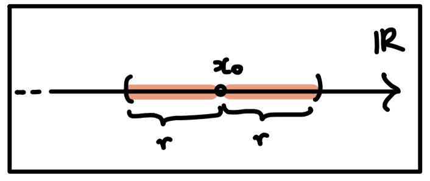
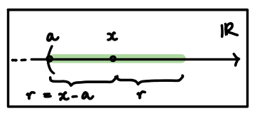

# Appunti Analisi Matematica

## Simboli matematici in ordine sparso usati in questo how to...

$\iff$ se e solo se (coimplicazione logica)

$\subseteq$ sotto insieme di

$\cap$ Intersezione

$:$ tale che nelle definizioni di insieme
## Riepilogo di alcuni insiemi numerici

* Insieme Numeri Naturali $\mathbb{N}$

$\mathbb{N} =\{1,\ 2,\ 3,\ 4,\ 5,\ 6,\ 7,\ 8,\ 9,\ 10,\ ...\}$

* Insieme dei numeri relativi $\mathbb{Z}$

$\mathbb{Z}= \{-5,\ -4,\ -3,\ -2,\ -1,\ 0,\ 1,\ 2,\ 3,\ 4,\ 5,\ ...\}$

* Insieme dei numeri razionali relativi $\mathbb{Q}$

Ed esempio:

 $-\frac{3}{2},\ -\frac{1}{2},\ 1,\ 2,\ 3$

 * Insieme dei numeri reali $\mathbb{R}$

 è definito come unione dei numeri razionali e irrazionali 

 $\mathbb{R} =\mathbb{Q} \cup \mathbb{I}$

 Sono tutti i numeri positvi e negativi (zero incluso)

 Ed esempio:

 $-\frac{3}{2},\ -\frac{1}{2},\ 1,\ 2,\ 3,  	\pi, \sqrt[4]{2}$

## Assiomi dei numeri reali

### Assiomi di ordinamento totale. 

Definisce la relazione $\leq$ tra coppie di elementi in $\mathbb{R}$ se:

1. **Proprieta di dicotomia:** per ogni coppia di $a,b \in \mathbb{R}$ si ha $a \le b$ o $b \le a$
2. **Proprietà di antisimmetria:** se $a \le b$ e $b \le a$ allora $a = b$
3. **Proprietà transitiva:** se $a \le b$ e $b \le c$ allora $a \le c$
4. **Proprietà simmetrica** per ogni elemento $a \in \mathbb{R}$ vale $a \le a$

### Alcuni assiomi relativi alle operazioni
------
1. **Proprietà commutativa della somma:** per ogni $a, b \in \mathbb{R}$ si ha che $ a + b = b + a$
2. **Proprietà associativa della somma:**  $\forall\ a, b \in \mathbb{R}$ si ha $a + (b + c) = ( a + b ) + c$
3. **Proprietà elemento neutro (lo zero) rispetto alla somma:** $0 + a = a + 0 = a $
4. **Esistenza elemento opposto:** $\forall\ a \in \mathbb{R}$ esiste un $-a\ \in \mathbb{R}$ tale che $a + (-a) = 0$
------
1. **Proprietà commutativa moltiplicazione:** $\forall\ a,b \in \mathbb{R}$ si ha che $ab = ba$
2. **Proprietà associativa della moltiplicazione:** $\forall\ a,b \in \mathbb{R}$ si ha che $a(bc) = (ab) c$
3. **Proprietà elemento neutro (il numero 1) rispetto alla moltiplicazione:**  $\forall\ a \in \mathbb{R}$ si ha che  $1a = a1 = a$
4. **Esistenza elmento inverso:** $\forall\ a \in \mathbb{R}, a \mathbb{N}e 0$ esiste un solo $a^{-1} \in \mathbb{R}$ per cui $aa^{-1} = a^{-1}a = 1 $ Il numero $a^{-1}$ si esprime anche con $\frac{1}{a}$

## Massimo e minimo insieme numeri reali

### Definizione di maggiorante

$L \in \mathbb{R}$ è maggiorante di A se $\forall\ a \in A$ si ha che $a \le L$

### Definizione di minorante
$l \in \mathbb{R}$ è minorante di ha se $\forall\ a \in A$ si ha che $a \ge l$

### Massimo di un insieme

1. se M è un maggiorante di A
2. se $M \in A$

### Minimo di un insieme

1. se m è un minorante di A
2. se $m \in A$

### Insieme limitato superiormente

Dato $A \subseteq \mathbb{R}$ (A sottoinsieme di $\mathbb{R}$) $A$ è limitato superiormente se esiste un maggiorante di $A$

### Insieme limitato inferiormente

Dato $A \subseteq \mathbb{R}$ (A sottoinsieme di $\mathbb{R}$) $A$ è limitato inferiormente se esiste un minorante di $A$

### Estremo superiore

Sia $A \subseteq \mathbb{R}$ limitato superiormente. L'estremo superiore di $A$ è il minimo dei maggioranti di $A$ e si indica con "sup $A$"

### Estremo inferiore

Sia $A \subseteq \mathbb{R}$ limitato inferiormente. L'estremo inferiore di $A$ è il più grande dei minoranti di $A$ e si indica con "inf $A$"

## Topologia della retta reale

Si definisce modulo o valore assoluto di $a$ il massimo tra $a$ ed il suo opposto $-a$

$\mid a \mid\ = max\ ${$a,-a$}

### Distanza

Per $x,y \in \mathbb{R}$ la distanza tra $x$ e $y$ si definisce con:

$d(x,y) =\  \mid x - y \mid$

#### (Alcune) Proprietà distanza

* La distanza tra $x$ e $y$ è maggiore o uguale a 0 per ogni $x$ e $y$ appartenenti all'insieme dei numeri reali.

$d(x,y) \ge 0$ , $\forall\ x,y \in  \mathbb{R}$

* La distanza tra $x$ e $y$ è uguale a 0 se e solo se $x$ è uguale a $y$.

$d(x,y) = 0$ $\iff  x = y $

* La distanza tra $x$ e $y$ è uguale alla distanza tra $y$ e $x$ per ogni $x$ e $y$ appartenenti all'insieme dei numeri reali
$d(x,y) = d(y,x)$ , $ \forall\ x,y \in \mathbb{R}$
### Intorno sferico

Dato $x_0 \in \mathbb{R}$ e $r > 0$  definiamo intorno sferico di centro $x_0$ e raggio $r$ l'insieme di tutti i numeri reali la cui distanza da $x_0$ è minore di $r$

Rappresentazione grafica dell'intorno sferico:

Spiegazione definizione:

$B_r(x_0) =\ ${$x \in \mathbb{R}: d(x,x_0) < r$}$\ = \ ${$\ x \in \mathbb{R}: |x - x_0| < r $}

### Insieme Aperto

Un insieme $A \subseteq \mathbb{R}$ si dice aperto se per ogni $x \in \mathbb{R}$ esiste un $r > 0$ (quindi un raggio dell'intorno sferico) tale che $B_r(x_0)$ è contenuto in $A$

Quindi è aperto quando l'intorno sferico è contentuo nell'insieme oggetto dell'analisi.

### Esempio Insieme Aperto

Di seguito un esempio di un insieme aperto:

L'insieme descritto dall'immagine è $(a, + \infty)\ =\ ${$ x \in \mathbb{R}: x > a $}

Infatti avendo dichiarato $x > a$ 

e immaginando che $r$ sia uguale sempre a $x - a$ ovvero la distanza tra $x$ e $a$ qualsiasi intorno sferico è contenuto in $A$

Quindi:

L'intorno sferico di x è contenuto nell'insieme $(a, +\infty) $

### Punti di accumulazione

Sia $A \subseteq \mathbb{R}$. Un punto $x \in A$ si dice **punto di accumulazione** per $A$ se in ogni intorno di $x$ è presente almeno un punto di $A$ diverso da $x$ oppure

$x_0$ è un punto di accumulazione per l’insieme $A$ se in ogni intorno di $x_0$ cadono infiniti elementi di $A$.

### Insieme chiuso (da rivedere)

Un insieme $D$ è chiuso se e solo se contiene tutti i suoi punti di accumulazione.

### Principio di induzione 

Una proposizione che da un indice $n \in N$ è vera per $n = 1$ e per $n + 1$. Allora è vera per ogni $n \in N$.

## Funzioni
### Definizione

Dati due insiemi $A$ e $B$ si dice funzione di $A$ in $B$ una legge che associa ad un elemento di $A$ uno ed un solo elemento di $B$

Di seguito il simbolo per definire la funzion di $A$ in $B$

$f: A \longrightarrow B $

$A$ è il dominio

$B$ è il codominio

L'elemento $y$ di $B$ è stato associato tramite $f$ all'elemento $x$ di $A$ e si indica con 

$ y = f(x) $ (si chiama anche immagine di $x$)

